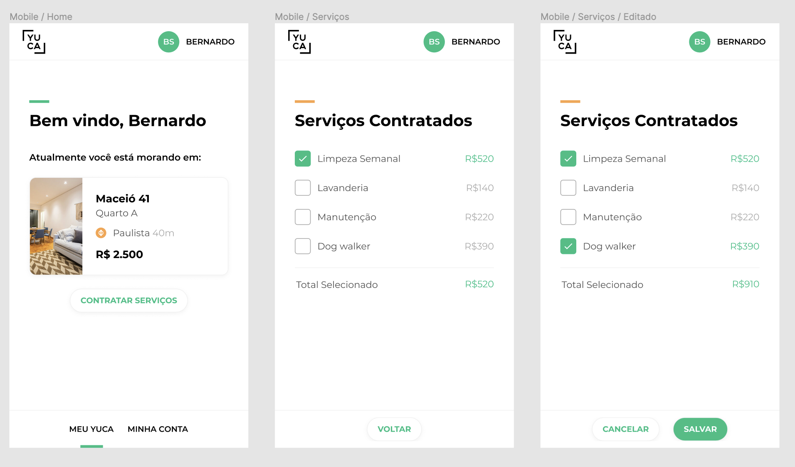

# Yuca Front-End Assessment

## Descrição

A Yuca oferece um pacote de serviços para que os yukers possam desfrutar da melhor experiência de viver em um Yuca!

Seu desafio é criar uma aplicação que permita que o yuker adicione ou remova serviços contratados no seu pacote de moradia, para desfrutar de mais comodidades ou abrir mão de algumas que ele já não precisa.
<br><br>

## Layout

O design de nossas telas é feito no [Figma](https://www.figma.com/). Você poderá ver com mais detalhes as interfaces da tarefa acessando este [link](https://www.figma.com/file/ofetdcZKc2BTuWHkAXJOBv/Teste-Front-End?node-id=0%3A1)


[](https://www.figma.com/file/ofetdcZKc2BTuWHkAXJOBv/Teste-Front-End?node-id=0%3A1)

*É recomendável logar no Figma para poder ver as propriedades de estilo dos componentes*
- A Tela inicial é a "Meu Yuca"  ("Bem-vindo, Bernardo")
- Tela "Serviços" é uma subseção da tela "Meu Yuca"
- Link "Minha Conta" não tem funcionalidade (mas sinta-se à vontade para implementar algo se quiser deixar a usabilidade mais legal)
<br><br>

## Critérios de aceite funcionais
Estes são os requisitos básicos para sua aplicação ser considerada completa:
- Criar estrutura responsiva
- Criar tela inicial "Meu Yuca"
- Criar tela "Serviços"
  - Ao adicionar e/ou remover serviços o valor exibido deve ser atualizado
  - Quando o botão 'salvar' for clicado, os serviços selecionados devem ser salvos usando a api de mock (\*)
  - Quando clicar em 'cancelar' as edições feitas devem ser descartadas

<br>

*(\*) mock server não persiste os dados*

<br><br>
## O que será analisado?

A ideia desta tarefa é apenas analisar o seu conhecimento em desenvolvimento front-end, portanto, quanto mais completa e "pronta pra produção" a aplicação estiver, melhor! Você está livre para usar qualquer framework de sua escolha, pode ser aquele que você já usa no seu dia a dia mesmo

Na Yuca, por exemplo, usamos: 
- React como framework
- StyledComponents pra gerência de estilos
- Design System interno que provém os temas e tokens visuais
- ApolloClient para fazer requisições e gerenciar estado local
- Jest e Cypress para testes

Consideraremos seu nível e momento profissional para a análise desta tarefa. Logo, nossas expectativas estarão alinhadas com a vaga que você pretende ocupar. O trabalho de um júnior, por exemplo, não será avaliado sob as mesmas condições de um sênior, então suas limitações ou aptidões técnicas serão super respeitadas e levadas em consideração no cumprimento dos itens abaixo.

### Infraestrutura
- setup de desenvolvimento
- setup de build/deploy/ci etc
- setup de testes

### Aplicação
- escolha e domínio do framework utilizado (react/vue/swelte/angular/etc)
- cobertura de testes
- arquitetura 

### Layout
- precisão visual
- responsividade
- organização/modularização/componentização dos estilos, o que escolher usar

<br><br>
## Mock API Examples

##### /ME [GET] ('https://private-42e99d-yuca1.apiary-mock.com/me')
```
curl 'https://private-42e99d-yuca1.apiary-mock.com/me' \
  -H 'authority: private-42e99d-yuca1.apiary-mock.com' \
  -H 'user-agent: Mozilla/5.0 (Macintosh; Intel Mac OS X 11_1_0) AppleWebKit/537.36 (KHTML, like Gecko) Chrome/87.0.4280.141 Safari/537.36' \
  -H 'dnt: 1' \
  -H 'accept: */*' \
  -H 'sec-gpc: 1' \
  -H 'origin: https://jsapi.apiary.io' \
  -H 'sec-fetch-site: cross-site' \
  -H 'sec-fetch-mode: cors' \
  -H 'sec-fetch-dest: empty' \
  -H 'referer: https://jsapi.apiary.io/' \
  -H 'accept-language: en-US,en;q=0.9' \
  --compressed
```

##### /SERVICES [GET] ('https://private-42e99d-yuca1.apiary-mock.com/services')
```
curl 'https://private-42e99d-yuca1.apiary-mock.com/services' \
  -H 'authority: private-42e99d-yuca1.apiary-mock.com' \
  -H 'user-agent: Mozilla/5.0 (Macintosh; Intel Mac OS X 11_1_0) AppleWebKit/537.36 (KHTML, like Gecko) Chrome/87.0.4280.141 Safari/537.36' \
  -H 'dnt: 1' \
  -H 'accept: */*' \
  -H 'sec-gpc: 1' \
  -H 'origin: https://jsapi.apiary.io' \
  -H 'sec-fetch-site: cross-site' \
  -H 'sec-fetch-mode: cors' \
  -H 'sec-fetch-dest: empty' \
  -H 'referer: https://jsapi.apiary.io/' \
  -H 'accept-language: en-US,en;q=0.9' \
  --compressed
```

##### /SERVICES [PUT] ('https://private-42e99d-yuca1.apiary-mock.com/services')
```
curl 'https://private-42e99d-yuca1.apiary-mock.com/services' \
  -X 'PUT' \
  -H 'authority: private-42e99d-yuca1.apiary-mock.com' \
  -H 'user-agent: Mozilla/5.0 (Macintosh; Intel Mac OS X 11_1_0) AppleWebKit/537.36 (KHTML, like Gecko) Chrome/87.0.4280.141 Safari/537.36' \
  -H 'dnt: 1' \
  -H 'content-type: application/json' \
  -H 'accept: */*' \
  -H 'sec-gpc: 1' \
  -H 'origin: https://jsapi.apiary.io' \
  -H 'sec-fetch-site: cross-site' \
  -H 'sec-fetch-mode: cors' \
  -H 'sec-fetch-dest: empty' \
  -H 'referer: https://jsapi.apiary.io/' \
  -H 'accept-language: en-US,en;q=0.9' \
  --data-binary $'{\n  "userId": 10,\n  "services": [1, 2, 3]\n}' \
  --compressed
```
